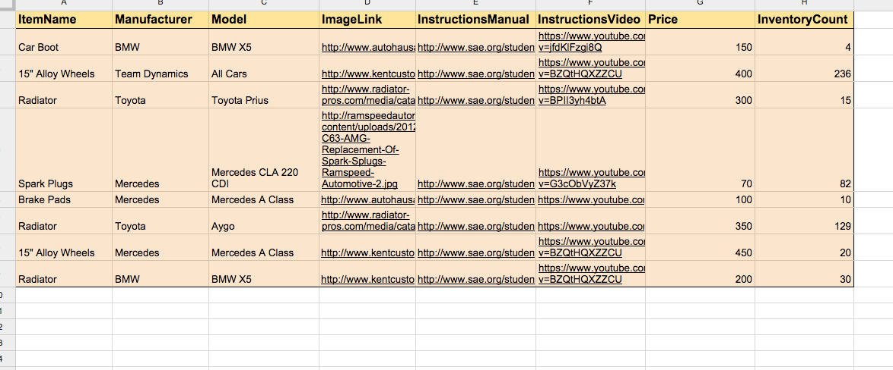
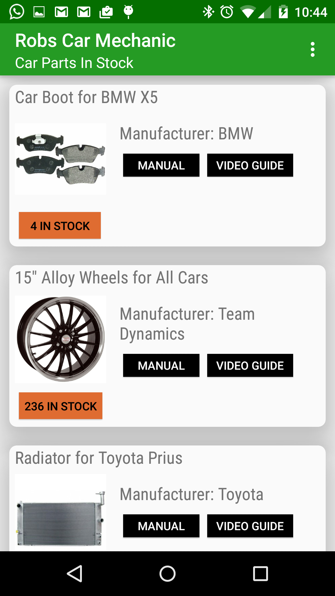
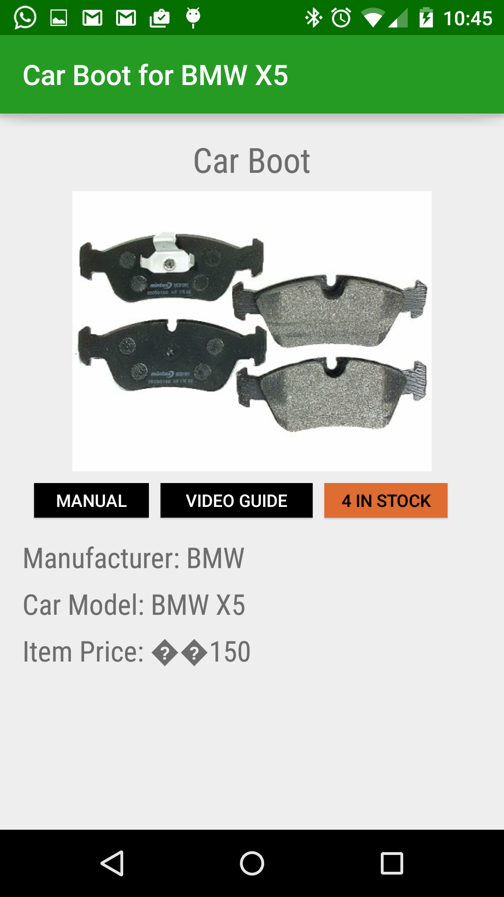

# Drive for Work backend - Manufacturing Android app #
Drive for Work customizable apk to demonstrate B2B manufacturing use case with Google Spreadsheets.
This is not intended to be a B2C app, but a B2B to be used by manufacturing employees or managers.

The apk uses this [spreadsheet as backend](ttps://docs.google.com/spreadsheets/d/1wxDCfS4e8tolR3lyJlIl-vzsMpbAQG1_EtzZQoGI2iU/edit?usp=sharing) as backend, mandatory to execute the apk. 
The apk makes use of JSON download functionality of Google Spreadsheets as explained [in this video](https://www.youtube.com/watch?v=RSgMEtRl0sw). 

The spreadsheet contains one Google Apps Script project in order to download data and certain parameters, like colors.

See info on Drive for Work here: [http://www.google.com/work](http://www.google.com/work), which offers unlimited storage and advanced audit controls.

## Android application Usage

1) Launch the apk

2) If desired, open the backend (spreadsheet) and customize text and colors.

## Backend

The backend is a [Google Spreadheet](https://docs.google.com/spreadsheets/d/1wxDCfS4e8tolR3lyJlIl-vzsMpbAQG1_EtzZQoGI2iU/edit?usp=sharing), hosted on Drive for Work.

## Libraries

The following libraries must be included for proper compilation and execution:
* android-suppport-v4
* android-support-appcompat-v7 (referenced)
* cardview (referenced)
* recyclerview

## Android release

The apk can be downloaded from [here](https://drive.google.com/file/d/0B6IAELMrLfE5MUtaS09jc1JIMlE/view?usp=sharing).
This apk uses Material Design concepts compiled with SDK target 21 (5.0) and tested on Nexus 5 with lollipop.
IDE used is Eclipse Luna

## Screenshots

